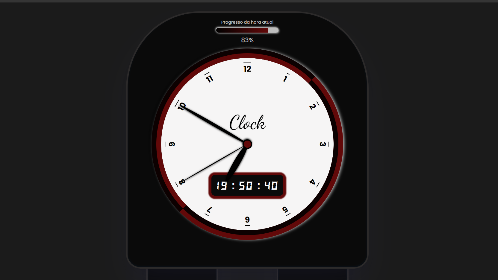

<h1 align="center"> Relógio digital </h1>

Relógio digital desenvolvido com JavaScript.  

 

  

## 🚀 Tecnologias

- HTML e SCSS
- JavaScript

## 💻 Projeto

<a href="https://digital-clock10.netlify.app/"> para visualizar clique aqui.</a>
